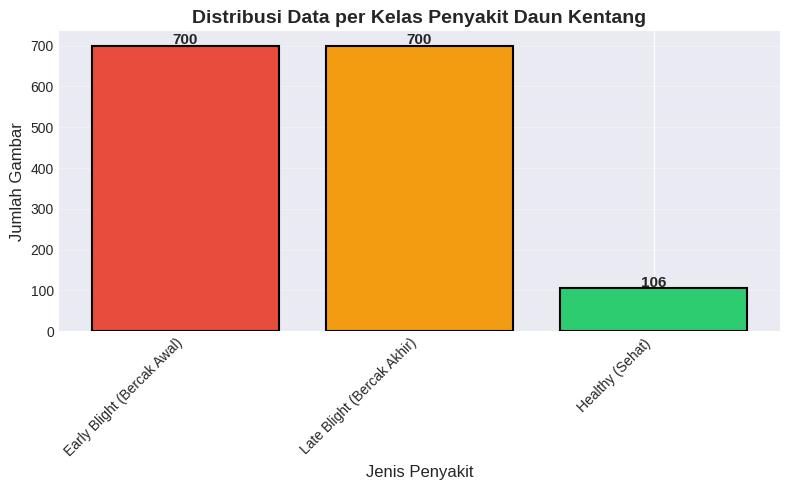
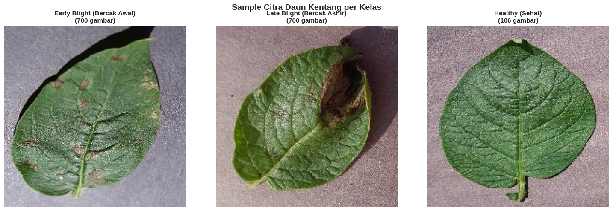
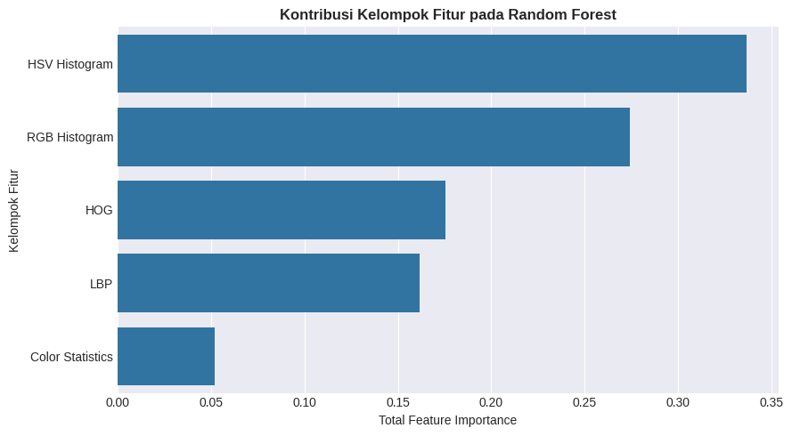
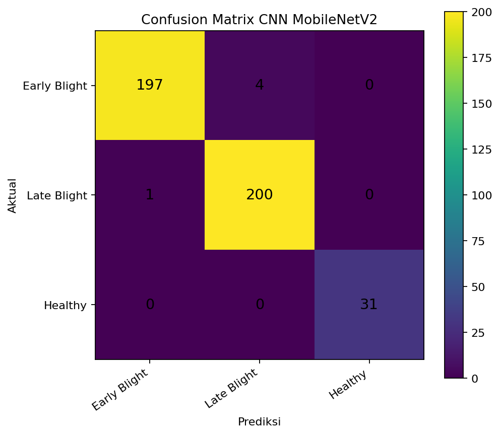
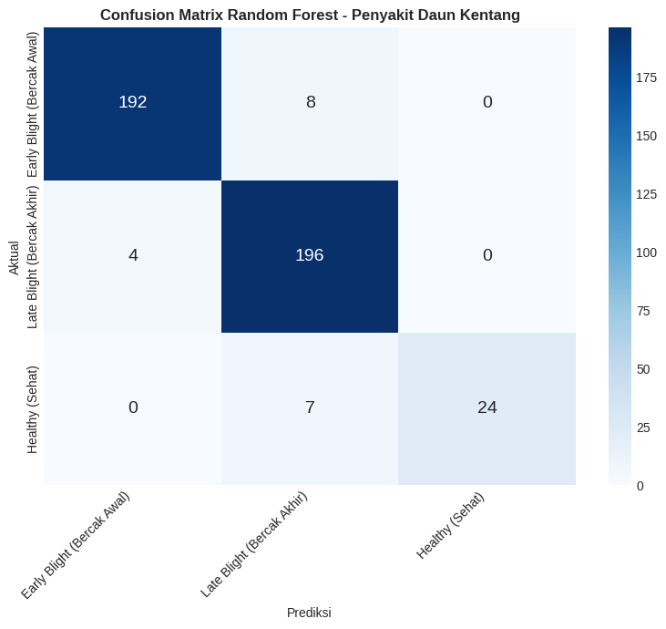

# LAPORAN UAS KECERDASAN BUATAN

## Perbandingan CNN MobileNetV2 dan Random Forest untuk Klasifikasi Penyakit Daun Kentang

---

## Identitas Kelompok

| Keterangan | Isi |
|---|---|
| Nama kelompok | **Isi sebelum dikumpulkan** |
| Anggota 1 | **Isi nama dan NIM** |
| Anggota 2 | **Isi nama dan NIM, hapus jika individu** |
| Mata kuliah | Kecerdasan Buatan |
| Dosen pengampu | **Isi nama dosen** |
| Program studi | **Isi program studi** |
| Tahun akademik | **Isi tahun akademik** |

---

# 1. Judul Proyek

**Perbandingan Convolutional Neural Network MobileNetV2 dan Random Forest untuk
Klasifikasi Penyakit Daun Kentang Berdasarkan Citra Digital**

## 1.1 Nama Kelompok

Proyek dikerjakan maksimal oleh dua orang:

- Anggota 1: **Isi nama dan NIM**
- Anggota 2: **Isi nama dan NIM atau hapus jika individu**

## 1.2 Domain Proyek

Proyek berada pada domain pertanian cerdas, computer vision, pengolahan citra,
dan kecerdasan buatan. Objek yang dianalisis adalah citra daun kentang dengan
tiga target klasifikasi: Early Blight, Late Blight, dan Healthy.

Penyakit daun menyebabkan perubahan warna, tekstur, serta pola bercak. Pemeriksaan
manual dapat dipengaruhi pengalaman pengamat. Sistem klasifikasi citra dapat menjadi
alat bantu awal untuk mempercepat pengenalan pola penyakit.

---

# 2. Business Understanding

## 2.1 Permasalahan Dunia Nyata

Early Blight dan Late Blight dapat memperlihatkan pola visual yang sulit dibedakan
oleh pengguna awam. Kesalahan pengenalan dapat menyebabkan keterlambatan penanganan.
Masalah yang dibahas adalah:

1. Bagaimana mengklasifikasikan gambar daun kentang ke dalam tiga kelas?
2. Apakah CNN dan Random Forest mampu memberikan generalisasi yang baik?
3. Algoritma mana yang memiliki performa terbaik?
4. Bagaimana pengaruh ketidakseimbangan kelas Healthy?
5. Apakah model mengalami overfitting atau underfitting?

## 2.2 Literature Review

Mohanty, Hughes, dan Salathé menunjukkan bahwa deep learning mampu menghasilkan
akurasi tinggi pada PlantVillage, tetapi performa dapat menurun ketika diuji pada
gambar yang berasal dari kondisi berbeda. Hal ini menegaskan bahwa test set dari
sumber yang sama belum sepenuhnya mewakili kondisi lapangan.

MobileNetV2 menggunakan inverted residual dan linear bottleneck untuk menghasilkan
CNN yang lebih efisien. Arsitektur ini cocok digunakan sebagai feature extractor
melalui transfer learning.

Random Forest menggabungkan banyak decision tree dan menggunakan voting untuk
menghasilkan prediksi. Pada proyek ini, Random Forest tidak menerima piksel mentah
secara langsung. Citra diubah menjadi fitur HOG, histogram RGB, histogram HSV,
Local Binary Pattern, dan statistik warna.

## 2.3 Tujuan Proyek

1. Membangun model CNN MobileNetV2.
2. Membangun model Random Forest sebagai pembanding.
3. Mengevaluasi kedua model dengan metrik yang sama.
4. Mendeteksi indikasi overfitting dan underfitting.
5. Menentukan model dengan performa terbaik.
6. Mengekspor model untuk kebutuhan implementasi.

## 2.4 Pengguna Sistem

- mahasiswa dan peneliti;
- petani sebagai pengguna pendukung;
- penyuluh pertanian;
- pengembang aplikasi klasifikasi tanaman;
- institusi pendidikan.

Prediksi model merupakan bantuan awal, bukan pengganti pemeriksaan ahli pertanian.

## 2.5 Solusi dan Manfaat Implementasi AI

Sistem menerima gambar daun dan menghasilkan kelas prediksi serta confidence.
Manfaat implementasi:

- identifikasi awal yang lebih cepat;
- hasil klasifikasi yang konsisten;
- perbandingan deep learning dan machine learning tradisional;
- model dapat dipakai pada aplikasi web;
- menjadi bahan evaluasi generalisasi model.

---

# 3. Data Understanding

## 3.1 Sumber Data

Dataset merupakan subset daun kentang dari PlantVillage yang diperoleh melalui Kaggle:

- <https://www.kaggle.com/datasets/arajmishra/potato-dataset>
- <https://www.kaggle.com/datasets/emmarex/plantdisease>

## 3.2 Ukuran dan Distribusi Data

| Kelas | Jumlah | Persentase |
|---|---:|---:|
| Early Blight | 1.000 | 46,47% |
| Late Blight | 1.000 | 46,47% |
| Healthy | 152 | 7,06% |
| **Total** | **2.152** | **100%** |

Kelas Healthy merupakan kelas minoritas.

## 3.3 Format Data

Data berupa citra RGB berukuran asli 256 x 256 piksel. Struktur folder:

```text
PlantVillage/
├── Potato___Early_blight/
├── Potato___Late_blight/
└── Potato___healthy/
```

## 3.4 Deskripsi Fitur

### CNN MobileNetV2

CNN menggunakan citra RGB 224 x 224. Fitur dipelajari otomatis oleh convolutional
layer, mulai dari tepi, tekstur, pola bercak, hingga kombinasi pola penyakit.

### Random Forest

| Fitur | Deskripsi |
|---|---|
| HOG | Gradien, tepi, bentuk, dan kontur |
| Histogram RGB | Distribusi warna merah, hijau, dan biru |
| Histogram HSV | Hue, saturation, dan value |
| LBP | Tekstur lokal permukaan daun |
| Statistik warna | Mean dan standard deviation kanal RGB dan HSV |

Setiap gambar Random Forest direpresentasikan sebagai 1.994 fitur.

## 3.5 Tipe Data dan Target

Tipe data adalah citra digital. Target merupakan label kategorikal:

1. Early Blight.
2. Late Blight.
3. Healthy.

---

# 4. Exploratory Data Analysis

## 4.1 Distribusi Data



Data training terdiri atas sekitar 700 Early Blight, 700 Late Blight, dan 106
Healthy. Ketidakseimbangan kelas dapat menyebabkan accuracy tinggi meskipun
performa kelas Healthy lebih rendah.

## 4.2 Sampel Citra



Early Blight memiliki pola bercak kecil dan tersebar. Late Blight cenderung
memiliki area gelap yang lebih besar, sedangkan Healthy memiliki warna hijau
yang lebih konsisten.

## 4.3 Analisis Korelasi dan Feature Importance

Korelasi piksel mentah tidak digunakan karena citra berdimensi tinggi. Untuk
Random Forest, analisis feature importance menghasilkan:

| Kelompok fitur | Importance |
|---|---:|
| Histogram HSV | 0,3367 |
| Histogram RGB | 0,2741 |
| HOG | 0,1755 |
| LBP | 0,1619 |
| Statistik warna | 0,0518 |



Warna memiliki kontribusi terbesar, tetapi fitur tekstur dan bentuk tetap penting.

## 4.4 Deteksi Data Tidak Seimbang

Kelas Healthy hanya 152 gambar atau 7,06% dari dataset. Penanganan yang digunakan:

- class weight pada CNN;
- `balanced_subsample` pada Random Forest;
- macro average dalam evaluasi;
- augmentasi hanya pada training CNN;
- split per kelas.

## 4.5 Pemeriksaan Kualitas Data

Hasil Random Forest mencatat:

- total gambar diperiksa: 2.152;
- file rusak: 0;
- duplikat identik: 0;
- duplikat lintas split: 0;
- seluruh gambar berukuran 256 x 256.

## 4.6 Insight Awal

1. Dataset tidak seimbang.
2. Warna merupakan pembeda penting.
3. Early Blight dan Late Blight berpotensi tertukar.
4. Healthy membutuhkan metrik khusus karena jumlahnya sedikit.
5. Kondisi latar yang terkontrol dapat membuat hasil internal lebih tinggi.

---

# 5. Data Preparation

## 5.1 Pembersihan Data

Pembersihan meliputi:

- validasi ekstensi file;
- pemeriksaan gambar rusak;
- pemeriksaan SHA-256 untuk duplikat identik;
- penghapusan folder split lama;
- pembuatan ulang train, validation, dan test.

## 5.2 Encoding Target

CNN menggunakan label kategorikal one-hot melalui generator. Random Forest
menggunakan label integer 0, 1, dan 2.

## 5.3 Normalisasi

CNN menggunakan `MobileNetV2.preprocess_input`, sehingga nilai piksel disesuaikan
ke rentang yang sesuai dengan bobot ImageNet.

Random Forest menormalisasi histogram agar tidak bergantung pada jumlah piksel.
Scaling standar tidak diwajibkan karena decision tree menggunakan pemisahan threshold.

## 5.4 Split Data

Kedua notebook menggunakan konsep pembagian 70% train, 10% validation, dan 20% test,
tetapi terdapat perbedaan pembulatan.

### CNN

- Train: 1.506.
- Validation: 213.
- Test: 433.
- Distribusi test: 201 Early Blight, 201 Late Blight, dan 31 Healthy.

### Random Forest

- Train: 1.506.
- Validation: 215.
- Test: 431.
- Distribusi test: 200 Early Blight, 200 Late Blight, dan 31 Healthy.

Perbedaan dua gambar berasal dari parameter pembagian data yang sedikit berbeda.
Untuk eksperimen lanjutan, kedua model sebaiknya memakai daftar file split identik.

## 5.5 Augmentasi

CNN menggunakan:

- rotation 20 derajat;
- width dan height shift 10%;
- zoom 10%;
- horizontal flip;
- brightness 0,8–1,2.

Random Forest tidak menggunakan augmentasi. Ketidakseimbangan ditangani dengan
class weight.

---

# 6. Modeling

## 6.1 Pemilihan Algoritma

Dua algoritma dipilih karena mewakili pendekatan berbeda:

- CNN MobileNetV2 mempelajari fitur otomatis.
- Random Forest memakai feature engineering manual.

## 6.2 CNN MobileNetV2

Arsitektur:

```text
Input 224 x 224 x 3
        |
MobileNetV2 pretrained ImageNet
        |
GlobalAveragePooling2D
        |
Dense 128 ReLU
        |
Dropout 0,3
        |
Dense 3 Softmax
```

Konfigurasi penting:

- optimizer Adam;
- learning rate 0,001;
- categorical crossentropy;
- 15 epoch;
- EarlyStopping;
- ReduceLROnPlateau;
- ModelCheckpoint berdasarkan validation loss;
- class weight.

## 6.3 Random Forest

Random Forest menggunakan konfigurasi:

```python
RandomForestClassifier(
    n_estimators=400,
    max_depth=30,
    min_samples_split=2,
    min_samples_leaf=1,
    max_features="sqrt",
    bootstrap=True,
    oob_score=True,
    class_weight="balanced_subsample",
    random_state=42,
    n_jobs=-1
)
```

Alur model:

```text
Gambar
  |
Resize 128 x 128
  |
HOG + RGB + HSV + LBP + statistik warna
  |
Vektor 1.994 fitur
  |
400 decision tree
  |
Voting
  |
Prediksi kelas
```

## 6.4 Perbandingan Konseptual

| Aspek | CNN MobileNetV2 | Random Forest |
|---|---|---|
| Feature engineering | Otomatis | Manual |
| Input | Citra | Vektor fitur |
| GPU | Disarankan | Tidak diperlukan |
| Interpretasi | Lebih kompleks | Feature importance tersedia |
| Export | `.h5`, `.keras` | `.joblib` |
| Training | Berbasis epoch | Pembangunan pohon |
| Kelebihan utama | Pola visual kompleks | Ringan dan interpretatif |

---

# 7. Evaluation

## 7.1 Metrik Evaluasi

- Accuracy.
- Precision.
- Recall.
- F1-score.
- Macro average.
- Weighted average.
- Classification report.
- Confusion matrix.
- OOB score untuk Random Forest.

## 7.2 Hasil CNN MobileNetV2

| Metrik | Nilai |
|---|---:|
| Accuracy | **0,9885** |
| Weighted Precision | **0,9886** |
| Weighted Recall | **0,9885** |
| Weighted F1-score | **0,9885** |
| Macro Precision | **0,9918** |
| Macro Recall | **0,9917** |
| Macro F1-score | **0,9917** |

Confusion matrix:

| Aktual \ Prediksi | Early Blight | Late Blight | Healthy |
|---|---:|---:|---:|
| Early Blight | 197 | 4 | 0 |
| Late Blight | 1 | 200 | 0 |
| Healthy | 0 | 0 | 31 |



CNN menghasilkan 428 prediksi benar dari 433 test dan hanya 5 kesalahan.

### Analisis Overfitting CNN

Model tidak mengalami underfitting karena performa training, validation, dan test
tinggi. Selisih accuracy training-validation kecil. Validation loss sempat
berfluktuasi, tetapi kembali menurun. Test accuracy 98,85% menunjukkan generalisasi
internal yang baik. Dengan demikian, tidak ditemukan overfitting signifikan.

## 7.3 Hasil Random Forest

| Metrik | Nilai |
|---|---:|
| Training Accuracy | 1,0000 |
| Validation Accuracy | 0,9581 |
| OOB Score | 0,9582 |
| Test Accuracy | **0,9559** |
| Weighted Precision | 0,9575 |
| Weighted Recall | 0,9559 |
| Weighted F1-score | 0,9553 |
| Macro Precision | 0,9695 |
| Macro Recall | 0,9047 |
| Macro F1-score | 0,9321 |

Classification report:

| Kelas | Precision | Recall | F1-score | Support |
|---|---:|---:|---:|---:|
| Early Blight | 0,98 | 0,96 | 0,97 | 200 |
| Late Blight | 0,93 | 0,98 | 0,95 | 200 |
| Healthy | 1,00 | 0,77 | 0,87 | 31 |

Confusion matrix:

| Aktual \ Prediksi | Early Blight | Late Blight | Healthy |
|---|---:|---:|---:|
| Early Blight | 192 | 8 | 0 |
| Late Blight | 4 | 196 | 0 |
| Healthy | 0 | 7 | 24 |



### Analisis Overfitting Random Forest

Training accuracy mencapai 100%, sedangkan validation accuracy 95,81% dan test
accuracy 95,59%. Gap accuracy sekitar 4,19%, tetapi gap training Macro F1 dan
validation Macro F1 mencapai 8,78%. Kelas Healthy memiliki recall 77%.

Kesimpulan:

> Random Forest tidak mengalami underfitting dan tidak mengalami overfitting berat,
> tetapi menunjukkan indikasi overfitting ringan, terutama pada generalisasi kelas
> minoritas Healthy.

## 7.4 Perbandingan Model

| Metrik | CNN MobileNetV2 | Random Forest |
|---|---:|---:|
| Test Accuracy | **98,85%** | 95,59% |
| Weighted Precision | **98,86%** | 95,75% |
| Weighted Recall | **98,85%** | 95,59% |
| Weighted F1 | **98,85%** | 95,53% |
| Macro F1 | **99,17%** | 93,21% |


CNN unggul sekitar 3,26 poin persentase pada accuracy dan 5,96 poin persentase
pada Macro F1.

## 7.5 Model Terbaik

Model terbaik adalah **CNN MobileNetV2** karena:

1. accuracy tertinggi;
2. weighted F1 tertinggi;
3. macro F1 tertinggi;
4. seluruh citra Healthy pada test set dikenali;
5. hanya lima kesalahan dari 433 test.

Perbandingan tidak sepenuhnya identik karena jumlah test berbeda dua gambar.
Namun, selisih performa konsisten pada seluruh metrik sehingga CNN tetap menjadi
kandidat terbaik.

---

# 8. Kesimpulan dan Rekomendasi

## 8.1 Ringkasan Hasil

Proyek berhasil membangun dua model klasifikasi penyakit daun kentang. CNN
MobileNetV2 memperoleh accuracy 98,85%, sedangkan Random Forest memperoleh
95,59%. CNN lebih unggul pada weighted dan macro metrics.

## 8.2 Ketercapaian Tujuan

Tujuan proyek tercapai karena:

- dua algoritma berhasil diimplementasikan;
- EDA dan data preparation tersedia;
- evaluasi lengkap dilakukan;
- overfitting dan underfitting dianalisis;
- model terbaik ditentukan;
- model dapat diekspor;
- fungsi inference tersedia.

## 8.3 Kelebihan Model

### CNN

- performa tertinggi;
- feature learning otomatis;
- mampu menangkap pola kompleks;
- hasil seimbang antar kelas.

### Random Forest

- tidak membutuhkan GPU;
- ukuran model sekitar 1,61 MB;
- feature importance tersedia;
- training relatif cepat;
- mudah diekspor dengan joblib.

## 8.4 Keterbatasan

1. Kelas Healthy hanya 152 gambar.
2. Dataset menggunakan kondisi latar yang relatif terkontrol.
3. Split kedua model tidak identik secara mutlak.
4. Belum dilakukan cross-validation.
5. Model belum diuji luas pada citra lapangan.
6. Random Forest masih lemah pada recall Healthy.
7. CNN belum diuji pada domain shift yang besar.

## 8.5 Rekomendasi

1. Menambah gambar Healthy.
2. Menyamakan daftar file split kedua model.
3. Menggunakan stratified cross-validation.
4. Mengumpulkan foto kamera ponsel.
5. Menguji pencahayaan dan latar berbeda.
6. Melakukan fine-tuning MobileNetV2.
7. Mencoba EfficientNet, ResNet, SVM, atau XGBoost.
8. Menerapkan segmentasi daun.
9. Menampilkan confidence dan disclaimer.
10. Mengembangkan aplikasi Flask atau mobile.

---

# 9. Referensi

Breiman, L. (2001). Random forests. *Machine Learning, 45*, 5–32.
https://doi.org/10.1023/A:1010933404324

Dalal, N., & Triggs, B. (2005). Histograms of oriented gradients for human
detection. In *2005 IEEE Computer Society Conference on Computer Vision and
Pattern Recognition* (Vol. 1, pp. 886–893).
https://doi.org/10.1109/CVPR.2005.177

Ferentinos, K. P. (2018). Deep learning models for plant disease detection and
diagnosis. *Computers and Electronics in Agriculture, 145*, 311–318.
https://doi.org/10.1016/j.compag.2018.01.009

Hughes, D. P., & Salathé, M. (2015). An open access repository of images on
plant health to enable the development of mobile disease diagnostics.
*arXiv*. https://doi.org/10.48550/arXiv.1511.08060

Mohanty, S. P., Hughes, D. P., & Salathé, M. (2016). Using deep learning for
image-based plant disease detection. *Frontiers in Plant Science, 7*, 1419.
https://doi.org/10.3389/fpls.2016.01419

Ojala, T., Pietikäinen, M., & Mäenpää, T. (2002). Multiresolution gray-scale
and rotation invariant texture classification with local binary patterns.
*IEEE Transactions on Pattern Analysis and Machine Intelligence, 24*(7),
971–987. https://doi.org/10.1109/TPAMI.2002.1017623

Sandler, M., Howard, A., Zhu, M., Zhmoginov, A., & Chen, L.-C. (2018).
MobileNetV2: Inverted residuals and linear bottlenecks. In *Proceedings of
the IEEE Conference on Computer Vision and Pattern Recognition*
(pp. 4510–4520). https://doi.org/10.1109/CVPR.2018.00474

Shorten, C., & Khoshgoftaar, T. M. (2019). A survey on image data augmentation
for deep learning. *Journal of Big Data, 6*, 60.
https://doi.org/10.1186/s40537-019-0197-0

---

# 10. Lampiran

## 10.1 Notebook

- [Notebook utama](uas_model.ipynb)
- [Notebook CNN](uas_model_CNN.ipynb)
- [Notebook Random Forest](uas_model_RF.ipynb)

## 10.2 Tautan Colab

- [CNN MobileNetV2](https://colab.research.google.com/drive/11NVcHo8LhHZAdXPMuBQSmqs8_bRaxUnV?usp=sharing)
- [Random Forest](https://colab.research.google.com/drive/1ZQOw-DF_552LxXv4yXyx-c1y0RrcJO2U?usp=sharing)

## 10.3 Data Hasil Evaluasi

- [CSV](data/hasil_evaluasi.csv)
- [JSON](data/hasil_evaluasi.json)

## 10.4 Model Export

CNN:

```text
Model/potato_disease_model.h5
Model/potato_disease_model.keras
Model/model_config.json
```

Random Forest:

```text
Model_RF/potato_random_forest.joblib
Model_RF/random_forest_config.json
```

## 10.5 Repository GitHub

<https://github.com/MochRaskyy16/UAS-KecerdasanBuatan->
