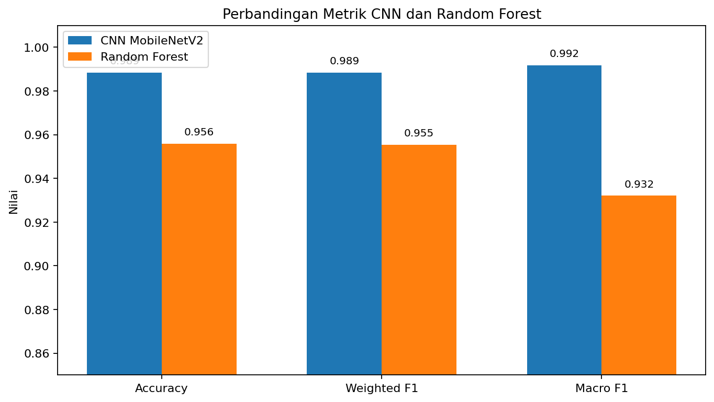

# UAS Kecerdasan Buatan

## Perbandingan CNN MobileNetV2 dan Random Forest untuk Klasifikasi Penyakit Daun Kentang

Repository ini berisi proyek Ujian Akhir Semester mata kuliah Kecerdasan Buatan.
Proyek membandingkan dua pendekatan klasifikasi citra daun kentang:

1. **CNN MobileNetV2** dengan transfer learning.
2. **Random Forest** dengan fitur HOG, histogram RGB, histogram HSV,
   Local Binary Pattern, dan statistik warna.

## Identitas Kelompok

| Keterangan | Isi |
|---|---|
| Nama kelompok | Klasifikasi Penyakit Daun Kentang |
| Anggota 1 |Moch Rasky Putra Softiawan/2406083 |
| Anggota 2 | Ficky Malvialudin/2406082 |
| Dosen pengampu | Leni Fitria ST.M.kom |
| Program studi | Teknik Informatika|

## Tautan Google Colab

- [CNN MobileNetV2](https://colab.research.google.com/drive/11NVcHo8LhHZAdXPMuBQSmqs8_bRaxUnV?usp=sharing)
- [Random Forest](https://colab.research.google.com/drive/1ZQOw-DF_552LxXv4yXyx-c1y0RrcJO2U?usp=sharing)

Pastikan akses kedua notebook diatur menjadi **Anyone with the link — Viewer**.

## Struktur Repository

```text
UAS-KecerdasanBuatan-/
├── README.md
├── Laporan_uas.md
├── uas_model.ipynb
├── uas_model_CNN.ipynb
├── uas_model_RF.ipynb
├── requirements.txt
├── ANALISIS_VALIDASI.md
├── assets/
│   ├── cnn_confusion_matrix.png
│   ├── rf_confusion_matrix.png
│   ├── rf_feature_importance.png
│   ├── rf_generalisasi.png
│   ├── ringkasan_perbandingan_model.png
│   └── ...
└── data/
    ├── hasil_evaluasi.csv
    ├── hasil_evaluasi.json
    ├── dataset/
    │   └── README.md
    └── Jurnal/
        ├── README.md
        └── referensi_APA.md
```

## Dataset

Dataset berasal dari PlantVillage melalui Kaggle dan terdiri atas 2.152 gambar:

| Kelas | Jumlah |
|---|---:|
| Early Blight | 1.000 |
| Late Blight | 1.000 |
| Healthy | 152 |
| **Total** | **2.152** |

Sumber:

- <https://www.kaggle.com/datasets/arajmishra/potato-dataset>
- <https://www.kaggle.com/datasets/emmarex/plantdisease>

## Langkah Pengerjaan

### 1. Data Collection

Dataset diunggah dalam bentuk ZIP ke Google Colab dan diekstrak. Folder kelas
yang digunakan adalah `Potato___Early_blight`, `Potato___Late_blight`,
dan `Potato___healthy`.

### 2. Data Understanding

Tahap ini memeriksa jumlah gambar, ukuran citra, format file, label, file rusak,
dan duplikasi identik.

### 3. Exploratory Data Analysis

EDA menampilkan distribusi kelas, contoh citra, ketidakseimbangan data,
dan pola visual awal.

### 4. Data Preparation

CNN menggunakan resize 224 x 224, `preprocess_input`, augmentasi, dan class weight.
Random Forest menggunakan resize 128 x 128 dan ekstraksi 1.994 fitur.

### 5. Modeling

CNN menggunakan MobileNetV2 pretrained ImageNet. Random Forest menggunakan
400 pohon, `max_depth=30`, OOB score, dan `balanced_subsample`.

### 6. Evaluation

Evaluasi menggunakan accuracy, precision, recall, F1-score, macro average,
weighted average, classification report, dan confusion matrix.

### 7. Export Model

CNN diekspor ke `.h5` dan `.keras`. Random Forest diekspor ke `.joblib`.

## Ringkasan Hasil

| Model | Accuracy | Weighted F1 | Macro F1 |
|---|---:|---:|---:|
| CNN MobileNetV2 | **98,85%** | **98,85%** | **99,17%** |
| Random Forest | 95,59% | 95,53% | 93,21% |

CNN menjadi model terbaik. Random Forest menunjukkan indikasi overfitting ringan
karena training accuracy 100%, sedangkan validation Macro F1 91,22%.



## Cara Menjalankan

### CNN

1. Buka `uas_model_CNN.ipynb` di Google Colab.
2. Pilih **Runtime > Change runtime type > T4 GPU**.
3. Pilih **Runtime > Run all**.
4. Upload ZIP dataset saat diminta.
5. Download model `.h5` setelah training selesai.

### Random Forest

1. Buka `uas_model_RF.ipynb` di Google Colab.
2. Runtime CPU sudah cukup.
3. Pilih **Runtime > Run all**.
4. Upload ZIP dataset yang sama.
5. Download model `.joblib` setelah training selesai.

## Catatan Perbandingan

Pembagian data pada output yang tersedia memiliki perbedaan pembulatan:

- CNN menggunakan 433 gambar test.
- Random Forest menggunakan 431 gambar test.

Karena itu, hasil tetap menunjukkan kecenderungan CNN lebih unggul, tetapi
eksperimen yang sepenuhnya setara sebaiknya memakai daftar file split yang sama.

## Laporan dan Referensi

- [Laporan lengkap](Laporan_uas.md)
- [Referensi ilmiah](data/Jurnal/referensi_APA.md)
- [Hasil analisis notebook](ANALISIS_VALIDASI.md)

## Repository Tujuan

<https://github.com/MochRaskyy16/UAS-KecerdasanBuatan->
